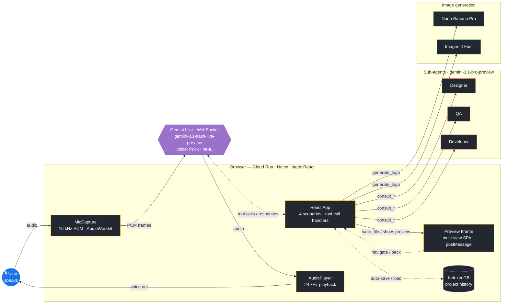
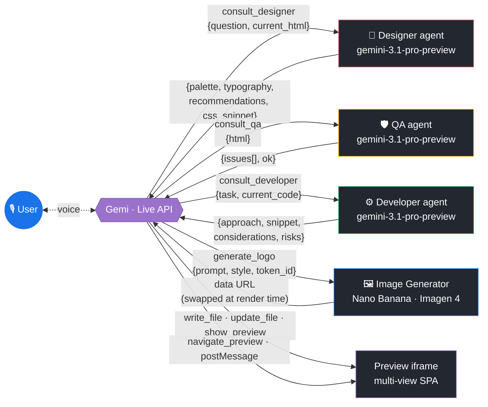

# Vibe Coding with Gemini Live

An on-stage, voice-first demo suite for **Google Cloud Summit** showcasing what
**Gemini Live** can do when you wire it directly to a real product surface —
not just a chat box.

Four interactive scenarios, all in-browser, all streaming over the Gemini Live
WebSocket. Speak. The model thinks, speaks back, *and drives the UI* through
tool-calls in real time.

**Live demo:** https://googlive-1069070785804.us-central1.run.app
**Deck explaining how it works:** [`slides.html`](./slides.html)

---

## The four scenarios

| # | Scenario | What you do | What Gemini does |
|---|----------|-------------|------------------|
| 1 | **Solutions Architect** | Describe an app you want to build | Speaks back + renders a Mermaid GCP architecture diagram live |
| 2 | **Vera — Visual Product Survey** | Show a product on camera; demonstrate opening the bottle | Watches the video stream, coaches you through the demonstration, fills out a structured survey report |
| 3 | **Pair with Gemi** | A full *vibe-coding* loop: discovery → architecture → UI build → live edits | Asks discovery questions in Hebrew, sketches GCP architecture, generates a self-contained multi-view HTML prototype with AI-generated images, lets you edit it by voice |
| 4 | **Live Translation** | Speak English (or any of 15 languages) | Streams Hebrew (or any target language) audio + transcript back in near-real-time |

All four hang off a single hub (`googlive/hub.jsx`).

---

## What makes "Pair with Gemi" different

Most "AI coder" demos are text-to-text. Gemi is **voice-to-product**:

1. **Discovery** — Gemi asks 3–4 short questions in Hebrew about what you want
   to build.
2. **Architecture** — He calls `propose_architecture(...)` with a Mermaid
   flowchart of 5–9 Google Cloud services. You can ask for variants ("show me
   another option") until you approve one by saying "let's build this."
3. **UI Build** — He consults a **Designer sub-agent** for a colour palette and
   typography, generates **logos and content images** with Nano Banana / Imagen 4,
   then writes a single self-contained `index.html` with multiple SPA views
   (login → dashboard → settings…). A **QA sub-agent** reviews it.
4. **Live Edits** — You speak changes ("make the background a dark gradient",
   "add a CTA in the hero", "show me the settings page"). Gemi calls the
   Designer/Developer/QA sub-agents as needed, then patches the file or
   navigates the iframe via `postMessage`. Generated projects auto-save to
   localStorage so you can pull them back up later.

The whole flow is driven by **function-calling tools** exposed on the Live API:
`propose_architecture`, `approve_architecture`, `start_build`, `write_file`,
`update_file`, `show_preview`, `generate_logo`, `navigate_preview`,
`consult_designer`, `consult_qa`, `consult_developer`.

---

## Architecture

Same Mermaid-flowchart styling as the architecture diagrams Gemi sketches
inside the Pair-with-Gemi scenario — one static frontend, three model
endpoints, every capability is a tool-call routed from React state.



### Agent topology

The Live API is the only thing the user talks to. Sub-agents are single-shot
JSON calls Gemi fans out and folds back in — each one shows up as a card in
the Agent Activity rail with timing + a deep link to its Agent Engine session.



Image generation and the sub-agents are **browser-direct** calls to
`generativelanguage.googleapis.com` — no backend round-trip — so the only
moving piece in production is a single Cloud Run service serving static files.

The repo *also* contains an `agents/` directory with **Google ADK** agents
deployable to **Vertex AI Agent Engine** for the same Designer/QA roles, plus
a small `proxy/` FastAPI service that fronts them with CORS. Both are live in
project `agentic-system-488914`; the browser fell back to direct
`gemini-3.1-pro-preview` calls after Agent Engine `stream_query` proved flaky
under load, but the deployable pieces remain for the "admin observability"
story (Agent Engine console → Sessions tab).

---

## Tech stack

| Layer | Tech |
|---|---|
| UI runtime | Static HTML + React 18 + in-browser Babel (no bundler) |
| Live conversation | `gemini-3.1-flash-live-preview` over WebSocket, voice "Puck", `languageCode: "he-IL"` |
| Sub-agents | `gemini-3.1-pro-preview` with `responseMimeType: "application/json"` and JSON schemas per role |
| Image generation | `nano-banana-pro-preview` (fast iconic) or `imagen-4.0-fast-generate-001` (photo-real) |
| Audio capture | AudioWorklet @ 16 kHz mono PCM |
| Audio playback | Queued AudioBufferSource @ 24 kHz |
| Diagrams | Mermaid with custom GCP-themed classDefs |
| Project export | JSZip (download) + GitHub push UI |
| Hosting | Cloud Run (Nginx serving static assets) |
| Optional backend | FastAPI proxy + Google ADK agents on Vertex AI Agent Engine |

---

## Run it locally

The app is plain static HTML; any local server works.

```bash
cd googlive
python3 serve.py     # serves on http://localhost:8080
# or
python3 -m http.server 8080
```

Put your Gemini API key in `googlive/config.local.js`:

```js
window.__GEMINI_API_KEY = "AIza...";
```

Open http://localhost:8080 and click any scenario card.

---

## Deploy to Cloud Run

```bash
gcloud run deploy googlive \
  --project=gemini-enterprise-495207 \
  --source=googlive/ \
  --region=us-central1 \
  --port=8080 \
  --quiet
```

The Dockerfile builds an Nginx image; `start.sh` writes `config.local.js` at
container start from environment variables (`GEMINI_API_KEY`,
`AGENT_PROXY_URL`).

---

## Deploy the optional ADK sub-agents

```bash
# One-time: staging bucket
gsutil mb -p agentic-system-488914 -l us-central1 gs://agentic-system-488914-agent-staging

# Deploy Designer + QA ADK agents to Vertex AI Agent Engine
gcloud builds submit agents/ \
  --config=agents/cloudbuild.yaml \
  --project=agentic-system-488914

# Deploy the FastAPI proxy
gcloud run deploy googlive-agents \
  --source proxy/ \
  --project=agentic-system-488914 \
  --region=us-central1 \
  --allow-unauthenticated \
  --set-env-vars=GCP_PROJECT=agentic-system-488914,ALLOWED_ORIGIN=https://googlive-1069070785804.us-central1.run.app
```

Then redeploy the frontend with `--update-env-vars=AGENT_PROXY_URL=<proxy url>`
to route sub-agent calls through Agent Engine for admin observability.

---

## Repo layout

```
googlive/                   ← static React app (the demo itself)
  app.jsx, hub.jsx          ← shell + scenario picker
  scenario-architect.jsx    ← Scenario 1
  scenario-survey.jsx       ← Scenario 2 (Vera)
  scenario-code.jsx         ← Scenario 3 (Pair with Gemi)
  scenario-translate.jsx    ← Scenario 4
  gemini-live.js            ← WebSocket client for Gemini Live
  sub-agents.js             ← Browser-direct Designer/QA/Developer + image gen
  components.jsx            ← Shared UI (AppBar, Transcript, useLiveSession…)
  audio.js, audio-worklet.js
  styles.css
  Dockerfile, nginx.conf, start.sh, serve.py

agents/                     ← Google ADK agents (optional)
  designer/agent.py
  qa/agent.py
  deploy.py
  cloudbuild.yaml

proxy/                      ← FastAPI proxy in front of Agent Engine (optional)
  main.py
  Dockerfile

slides.html                 ← The how-it-works deck
```

---

## What's in scope vs not

**In scope** — a credible live, on-stage demo that does what it says.
**Not in scope** — real auth on the generated previews, persisting projects
to a real backend, multi-turn sub-agent loops, Agent Engine for the Live
audio stream (the protocols don't line up).

---

Built for the Google Cloud Summit by Moshe.
